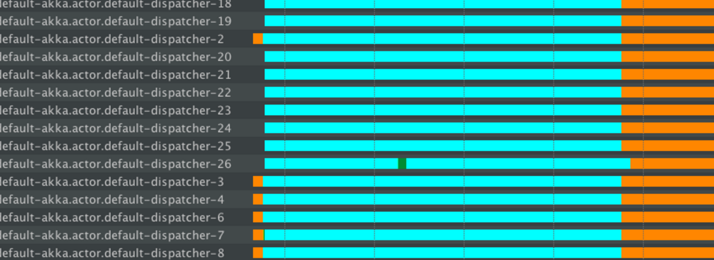
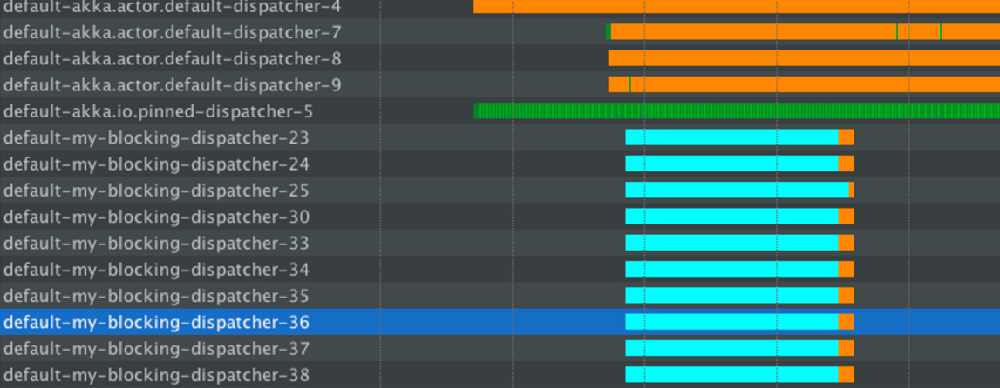

# 在 Akka HTTP 中处理阻塞操作

Sometimes it is difficult to avoid performing the blocking operations and there
are good chances that the blocking is done inside a Future execution, which may
lead to problems. It is important to handle the blocking operations correctly.

有时进行阻塞操作是难以避免的，并且很有可能在 Future 中完成了阻塞，但可能会导致问题。正确的处理阻塞操作很重要。

## Problem
**问题**

Using @scala[`context.dispatcher`]@java[`context.dispatcher()`] as the dispatcher on which the blocking Future
executes can be a problem - the same dispatcher is used by the routing
infrastructure to actually handle the incoming requests. 

使用 @scala[`context.dispatcher`]@java[`context.dispatcher()`] 作为在阻塞的 Future 上执行的调度器可能会有问题 -
因为路由基础设施使用同一个调度器处理进入的请求。

If all of the available threads are blocked, the routing infrastructure will end up *starving*. 
Therefore, routing infrastructure should not be blocked. Instead, a dedicated dispatcher
for blocking operations should be used.

如果所有可用线程都被阻塞，那路由基础设施将最终被 *饿死*。因此，路由基础设施不应被阻塞。作为替代，对阻塞操作使用专用的调度器。

@@@ note

Blocking APIs should also be avoided if possible. Try to find or build Reactive APIs,
such that blocking is minimised, or moved over to dedicated dispatchers.

如果可能，阻塞 API 应尽量避免使用。尝试找到或构建反应式 API，以使阻塞做小化，或将其移动到专用的调度器。

Often when integrating with existing libraries or systems it is not possible to
avoid blocking APIs. The following solution explains how to handle blocking
operations properly.

通常，当集成已存在的库或系统时，无法避免阻塞 API。以下解决方案说明了如何正确地处理阻塞操作。

Note that the same hints apply to managing blocking operations anywhere in Akka,
including in Actors etc.

注意，相同的提示适用于在 Akka 里任何地方管理阻塞操作，包括 actor 等。
@@@

In the thread state diagrams below the colours have the following meaning:

在下面的线程状态图中，颜色具有以下含义：

 * Turquoise - Sleeping state
 * Orange - Waiting state
 * Green - Runnable state

 * 绿松石 - 休眠状态
 * 橙色 - 休眠状态
 * 绿色 - 运行状态

The thread information was recorded using the YourKit profiler, however any good JVM profiler 
has this feature (including the free and bundled with the Oracle JDK VisualVM, as well as Oracle Flight Recorder). 

这里的线程信息使用 YourKit 分析器记录，然而任何好的 JVM 分析器都有这个功能（包括免费捆绑的 Oracle JDK VisualVM，以及 Oracle Flight Recorder）。

### Problem example: blocking the default dispatcher
**问题示例：阻塞默认调度程序**

Scala
:   @@snip [BlockingInHttpExamplesSpec.scala]($test$/scala/docs/http/scaladsl/server/BlockingInHttpExamplesSpec.scala) { #blocking-example-in-default-dispatcher }

Java
:   @@snip [BlockingInHttpExamples.java]($test$/java/docs/http/javadsl/server/BlockingInHttpExamples.java) { #blocking-example-in-default-dispatcher }

Here the app is exposed to a load of continuous GET requests and large numbers
of akka.actor.default-dispatcher threads are handling requests. The orange
portion of the thread shows that it is idle. Idle threads are fine -
they're ready to accept new work. However, large amounts of Turquoise (sleeping) threads are very bad!

这个应用程序承受了连续的 GET 请求负载，大量的 akka.actor.default-dispatcher 线程正在处理请求。
线程的橙色部分显示为空闲。空闲线程很好 - 它们准备接受新的工作 。但是，大量的绿松石（休眠）线程非常糟糕！



@@@ div { .group-scala }
After some time, the app is exposed to the load of POST requests,
which will block these threads.
一段时间后，该应用程序会承受 POST 请求的负载，这将阻塞这些线程。
@@@
@@@ div { .group-java }
Since we're using the Java `CompletableFuture` in this example, the blocking will happen on its
default pool which is the _global_ `ForkJoinPool.commonPool()`. With Scala Futures the in-scope 
provided dispatcher would be used. Both these dispatchers are ForkJoin pools by default, and are 
not best suited for blocking operations.

由在这个示例使用的是 Java 的 `CompletableFuture`，阻塞操作将在默认的（全局） `ForkJoinPool.commonPool()` 上进行。
对于 Scala Future，将使用范围内的调用器。默认情况下两者都使用 ForkJoin 池，但 ForkJoin 并不适合阻塞操作。
@@@
For example, the above screenshot shows an Akka FJP dispatchers threads,
named "`default-akka.default-dispatcher2,3,4`" going into the blocking state, after having been idle. 
It can be observed that the number of new threads increases, "`default-akka.actor.default-dispatcher 18,19,20,...`" 
however they go to sleep state immediately, thus wasting the resources.
@java[The same happens to the global @apidoc[ForkJoinPool] when using Java Futures.]

例如，上面截图显示名为“`default-akka.default-dispatcher2,3,4`”的 Akka FJP 调度器线程在空闲后进入阻塞状态。可以看到，新线程的数量增加了，
"`default-akka.actor.default-dispatcher 18,19,20,...`"，但是它们立即进行休眠状态，从而浪费的（线程）资源。
@java[使用 Java 的 Future 时，全局 @apidoc[ForkJoinPool] 同样如此。]

The number of such new threads depends on the default dispatcher configuration,
but it will likely not exceed 50. Since many POST requests are being processed, the entire
thread pool is starved. The blocking operations dominate such that the routing
infra has no thread available to handle the other requests.

这些新线程的数量依赖默认调度器的配置，但数量可能不会超过50。由于正在处理很多 POST 请求，整个线程池牌饥饿状态。阻塞操作占据统治地位，
因此路由基础设施将没有可用线程来处理其它请求。

In essence, the @scala[`Thread.sleep`]@java[`Thread.sleep()`] operation has dominated all threads and caused anything 
executing on the default dispatcher to starve for resources (including any Actors
that you have not configured an explicit dispatcher for).

本质上， @scala[`Thread.sleep`]@java[`Thread.sleep()`] 操作统治了所有线程，并导致在默认调度器上的任何操作都饿死了资源（包括没有配置显示调度器的 actor）。

## Solution: Dedicated dispatcher for blocking operations
**解决方案：专用调度器用于阻塞操作**

In `application.conf`, the dispatcher dedicated to blocking behaviour should
be configured as follows:

在 `application.conf`，专用于阻塞操作行为的调用器应配置如下：

```conf
my-blocking-dispatcher {
  type = Dispatcher
  executor = "thread-pool-executor"
  thread-pool-executor {
    fixed-pool-size = 16
  }
  throughput = 1
}
```

There are many dispatcher options available which can be found in @extref[Dispatchers](akka-docs:scala/dispatchers.html).

有很多可用的调度器选项，可以在 @extref[Dispatchers](akka-docs:scala/dispatchers.html) 找到。

Here `thread-pool-executor` is used, which has a hardcoded limit of threads. It keeps a set number of threads
available that allow for safe isolation of the blocking operations. The size settings should depend on the app's
functionality and the number of cores the server has.

这里 `thread-pool-executor` 被使用，硬编码了线程数限制。它保持一定数量的可用线程，以允许安全的隔离阻塞操作。（线程池）大小设置依赖于应用程序的功能，以及服务器的（CPU）核心数。

Whenever blocking has to be done, use the above configured dispatcher
instead of the default one:

每当必须进行阻塞时，使用上面配置的调度器来替代默认的调度器：

Scala
:   @@snip [BlockingInHttpExamplesSpec.scala]($test$/scala/docs/http/scaladsl/server/BlockingInHttpExamplesSpec.scala) { #blocking-example-in-dedicated-dispatcher }

Java
:   @@snip [BlockingInHttpExamples.java]($test$/java/docs/http/javadsl/server/BlockingInHttpExamples.java) { #blocking-example-in-dedicated-dispatcher }

This forces the app to use the same load, initially normal requests and then
the blocking requests. The thread pool behaviour is shown in the figure.

这迫使应用程序使用相同的负载，首先是正常请求，然后是阻止请求。线程池行为如图。



Initially, the normal requests are easily handled by the default dispatcher - the
green lines, which represent the actual execution.

最初，正常请求由默认调度器轻松地处理 - 绿线表示实际的执行。

When blocking operations are issued, the `my-blocking-dispatcher`
starts up to the number of configured threads. It handles sleeping. After
a certain period of nothing happening to the threads, it shuts them down.

当阻塞操作发生时，`my-blocking-dispatcher` 会启动，直到配置线程数都已启动为止。它处理休眠。线程在没有任何反应一段时间后，调度器将关闭它们。

If another bunch of operations have to be done, the pool will start new
threads that will take care of putting them into sleep state, but the
threads are not wasted.

如果必须执行另一堆操作，则线程池将启动新的线程，使它们（另一堆操作）进入睡眠状态，但时这些线程不会浪费。

In this case, the throughput of the normal GET requests was not impacted -
they were still served on the default dispatcher.

这种情况下，普通 GET 请求的吞吐量不受影响 - 他们将继续由默认调度器服务。

This is the recommended way of dealing with any kind of blocking in reactive
applications. It is referred to as "bulkheading" or "isolating" the bad behaving
parts of an app. In this case, bad behaviour of blocking operations.

这是在反应式应用程序中处理任何类型阻塞操作的推荐方式。它被称为“舱壁”（bulkheading）或“隔离”（isolating）应用程序的不良行为部分。

There is good documentation available in Akka docs section,
@extref[Blocking needs careful management](akka-docs:dispatchers.html#blocking-needs-careful-management).

对于这一主题，Akka 提供了很好的文档，参考
@extref[阻塞需要仔细管理 ](akka-docs:dispatchers.html#blocking-needs-careful-management) 。
